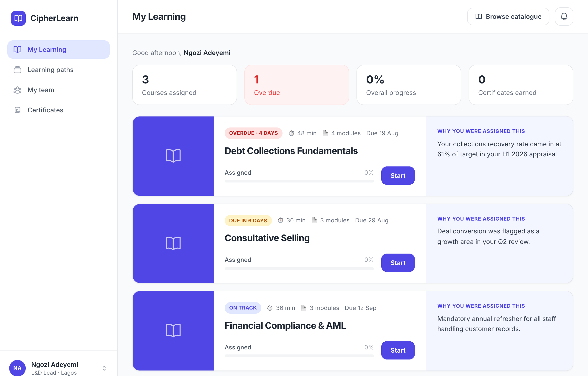
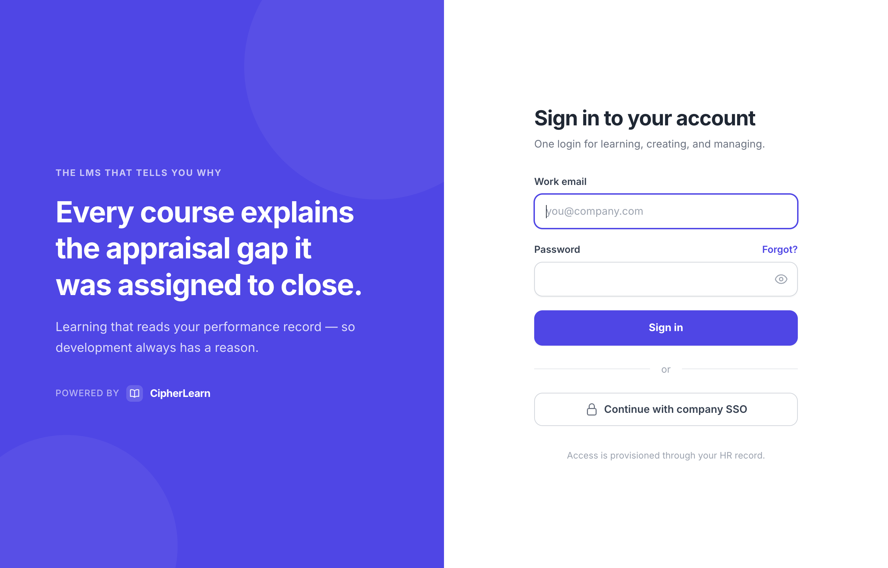
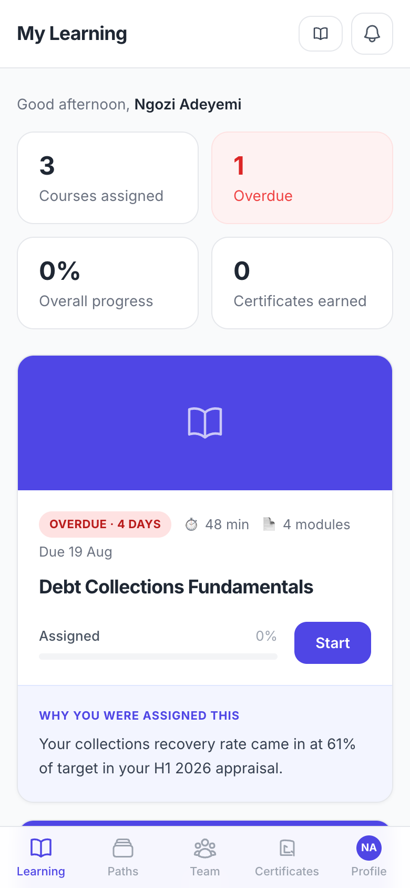
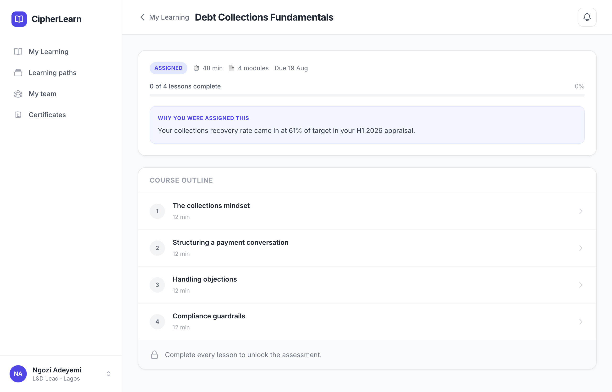
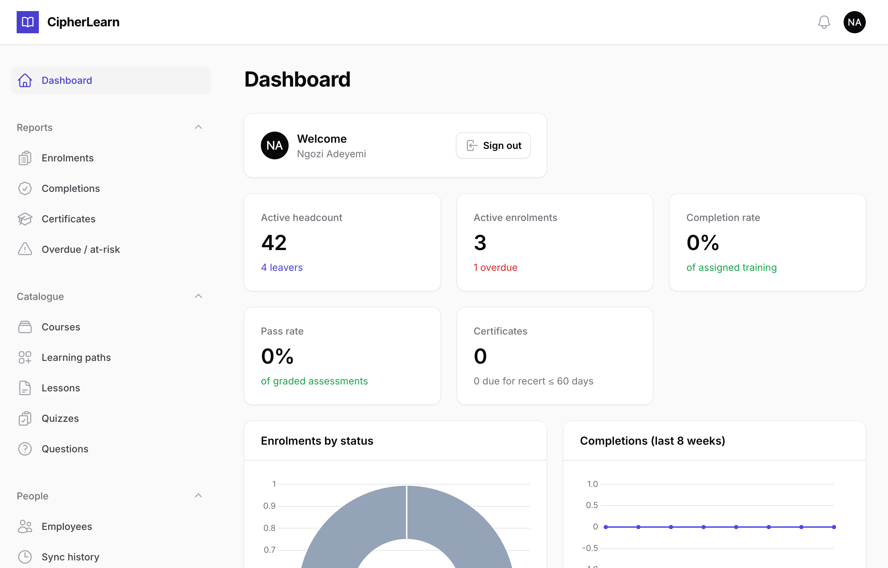
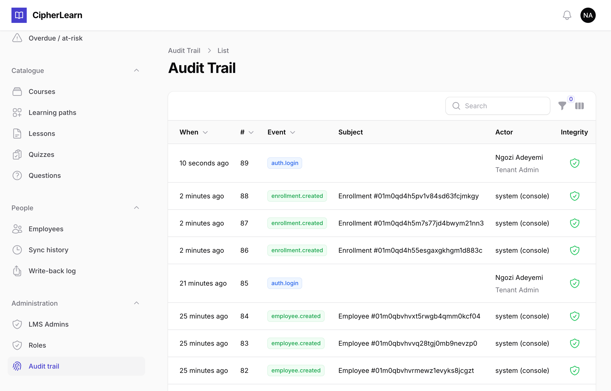

# CipherLearn

An HRIS-native Learning Management System. Every other LMS assigns courses
blindly; CipherLearn reads employee performance data (OKR/KPI based — **actual
measured against target**), finds measurable shortfalls, and assigns training
with a written justification the employee and their manager can both see. When
the employee passes, the completion is recorded back against their performance
record. That closed loop is the product.

CipherLearn is an **independent product that integrates with an external HRIS**,
not an HR-suite add-on. The integration sits behind a generic port with a mock
adapter as the default; **ExampleHR** — a fictional vendor used throughout this
project — is one illustrative implementation of that port.

> **Disclaimer.** "ExampleHR" is a fictional, illustrative placeholder. It does
> not represent, and is not affiliated with or endorsed by, any real company or
> product, and any resemblance to an actual HR/HRIS product or organisation —
> existing or historical — is coincidental. The HRIS adapter here demonstrates
> the port/adapter pattern against a hypothetical API; it is not an integration
> with any real third-party service. This note is informational, not legal advice.

## Stack

| Layer | Choice |
|---|---|
| Backend | PHP 8.3, Laravel 12 |
| Database | MySQL 8 |
| Learner + manager UI | Livewire 3 + Blade + Tailwind (v3) |
| Admin console | Filament 3 |
| Queue / cache / sessions | Redis |
| Object storage | S3-compatible (MinIO locally; AWS S3 / Huawei OBS in cloud) |
| Containers | Docker + Docker Compose |
| Tests | Pest |

**Why MySQL:** it matches the likely upstream platform and keeps an Aurora
migration path open. A MySQL-shaped schema moves to Postgres later; the reverse
does not.

**Cloud portability is a requirement.** Object storage is reached only through
the S3 API — no AWS-only managed services in application code.

## Prerequisites

- [Docker](https://docs.docker.com/get-docker/) + Docker Compose. That's it —
  PHP and Node are pulled as throwaway images during setup, so nothing else needs
  to be installed on the host.

## Quick start

```bash
git clone git@github.com:shegs-a/cipher-learn.git
cd cipher-learn
make up
```

`make up` copies `.env`, installs PHP/JS dependencies, builds the frontend, then
starts the whole stack (app, MySQL, Redis, MinIO). On first boot the app
container waits for MySQL, generates an `APP_KEY`, and runs migrations.

Then:

| URL | What |
|---|---|
| http://localhost:8000 | The app — learner portal (admin console at `/admin`) |
| http://localhost:8000/healthz | Liveness probe (no dependencies) |
| http://localhost:8000/readyz | Readiness probe (checks MySQL + Redis) |
| http://localhost:9001 | MinIO console (`cipherlearn` / `miniosecret`) |

Prefer raw Compose over `make`? The equivalent is:

```bash
cp .env.example .env
docker run --rm -v "$PWD":/app -w /app composer:2 install
docker run --rm -v "$PWD":/app -w /app node:20-alpine sh -c "npm ci && npm run build"
docker compose up --build
```

### Health endpoints

Liveness and readiness are deliberately separate. A failing **liveness** probe
should restart the container; a failing **readiness** probe should only pull it
out of the load balancer. `/healthz` therefore never touches a dependency, while
`/readyz` returns `503` with a per-dependency breakdown until MySQL and Redis
both answer:

```json
{
  "status": "ready",
  "checks": {
    "database": { "ok": true, "error": null },
    "redis":    { "ok": true, "error": null }
  }
}
```

## Development

Common tasks (see `make help` for the full list):

```bash
make test    # Pest suite
make pint    # code style check
make stan    # PHPStan (level 6)
make shell   # shell in the app container
make down    # stop the stack (keeps data)
make fresh   # stop and wipe data volumes
```

The stack bind-mounts the source tree, so PHP and Blade edits are live. After
changing frontend assets, rebuild them (`docker run --rm -v "$PWD":/app -w /app
node:20-alpine npm run build`) or run Vite in watch mode.

Logs are structured JSON written to stderr and collected by the container
runtime. Every line carries a `request_id` correlation id (see
`app/Http/Middleware/AssignRequestId.php`).

## Screenshots

Real screens from the running app (Inter, primary `#4f46e5`; tokens live in
`tailwind.config.js`).

### The learner portal — every course explains *why* it was assigned

The rationale a manager or the system attached is the hero of each card, next to
the urgency pill. This is the product's whole point.



### Sign in

One login for learners, managers and admins; where you land is decided by
permission.



### On a phone — a bottom tab bar, the same "why" hero



### Taking a course

Text-first lessons, then a server-graded quiz gated behind them.



### Admin dashboard

Tenant-scoped KPIs — coverage, completion, overdue, recent activity.



### Tamper-evident audit trail

An append-only, per-tenant hash chain. Each row shows a live integrity check (the
green shield), and `php artisan audit:verify` re-walks the whole chain.



## Project status

**v1.0.0 — feature-complete.** Built across twelve sprints (0–12), each captured in
`docs/` as a plan + report. The V1 feature set is done and production-packaged:
HRIS employee sync, RBAC, assignment-with-a-written-reason + request→approval, the
course journey (lessons, graded quizzes, certificates) with HR write-back, learning
paths, an admin dashboard, reports + CSV export, notifications, a tamper-evident
audit trail, a responsive learner portal, and deployment tooling.

243 tests; PHPStan level 6 and Pint clean on PHP 8.3. See
[CHANGELOG.md](CHANGELOG.md) for the full release notes and `docs/DEPLOY.md` to run
it.

The differentiator — reading performance data to auto-recommend training — is
intentionally deferred to a later line of work; V1 ships the manual,
reason-carrying assignment path.
